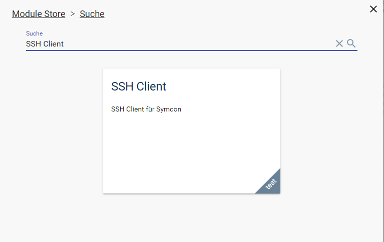
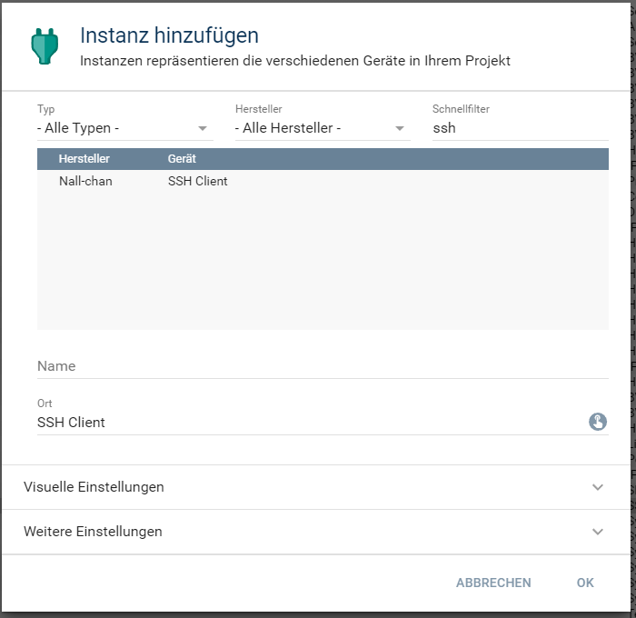
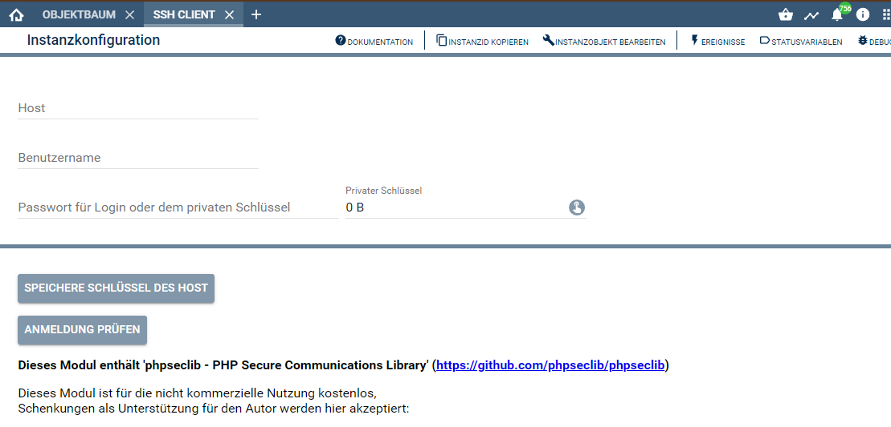
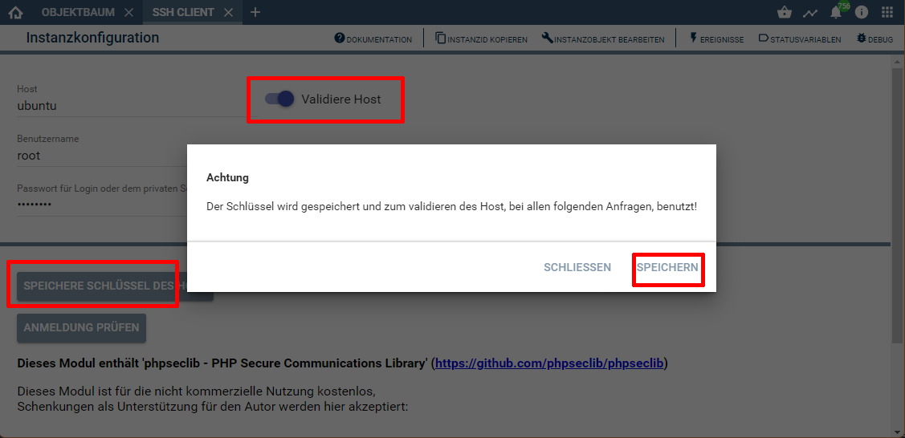
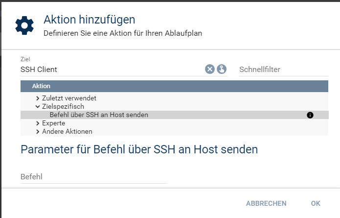

[](https://www.symcon.de/service/dokumentation/entwicklerbereich/sdk-tools/sdk-php/)
[]()
[](https://www.symcon.de/service/dokumentation/installation/migrationen/v60-v61-q1-2022/)  
[](https://creativecommons.org/licenses/by-nc-sa/4.0/)
[](https://github.com/Nall-chan/SSHClient/actions)
[](https://github.com/Nall-chan/SSHClient/actions)  
[](#6-spenden)  


# SSH Client <!-- omit in toc -->
Beschreibung des Moduls.

## Inhaltsverzeichnis <!-- omit in toc -->

- [1. Funktionsumfang](#1-funktionsumfang)
- [2. Voraussetzungen](#2-voraussetzungen)
- [3. Software-Installation](#3-software-installation)
- [4. Einrichten der Instanzen in IP-Symcon](#4-einrichten-der-instanzen-in-ip-symcon)
	- [Konfigurationsseite](#konfigurationsseite)
	- [Option: Validiere Host](#option-validiere-host)
	- [Option: privater Schlüssel](#option-privater-schlüssel)
- [5. Statusvariablen](#5-statusvariablen)
- [6. WebFront](#6-webfront)
- [7. PHP-Funktionsreferenz](#7-php-funktionsreferenz)
- [8. Aktionen](#8-aktionen)
- [9. Anhang](#9-anhang)
	- [1. Changelog](#1-changelog)
	- [2. Spenden](#2-spenden)
- [10. Lizenz](#10-lizenz)

## 1. Funktionsumfang

* Stellt einen SSH-Client als Modul bereit  
* Unterstützt Anmeldung per Passwort als auch per privaten Schlüssel  
* Optionale Validierung des Server möglich

## 2. Voraussetzungen

- IP-Symcon ab Version 6.1

## 3. Software-Installation

  Über den 'Module-Store' in IPS das Modul 'SSH-Client' hinzufügen.  
   **Bei kommerzieller Nutzung (z.B. als Errichter oder Integrator) wenden Sie sich bitte an den Autor.**  
 

## 4. Einrichten der Instanzen in IP-Symcon

 Unter 'Instanz hinzufügen' kann das 'SSH Client'-Modul mithilfe des Schnellfilters gefunden werden.  
   
	- Weitere Informationen zum Hinzufügen von Instanzen in der [Dokumentation der Instanzen](https://www.symcon.de/service/dokumentation/konzepte/instanzen/#Instanz_hinzufügen)

 ### Konfigurationsseite

  

| Name      | Text               | Beschreibung                                                                                               |
| --------- | ------------------ | ---------------------------------------------------------------------------------------------------------- |
| Address   | Host               | Adresse des SSH Servers                                                                                    |
| Username  | Benutzername       | Benutzername für die Anmeldung                                                                             |
| CheckHost | Validiere Host     | Benutzername für die Anmeldung                                                                             |
| Password  | Passwort           | Passwort für die Anmeldung. Bei Verwendung eines privaten Schlüssel, wird hier das Passphrase eingetragen. |
| KeyFile   | privater Schlüssel | Datei mit privatem Schlüssel                                                                               |

Der Button 'Anmeldung prüfen' kann zum überprüfen der Einstellungen verwendet werden.  

### Option: Validiere Host

  

Über den Button 'Speichere Schlüssel des Host' kann der öffentliche Schlüssel des Host abgerufen und anschließend in dr Instanz abgespeichert werden.  
Anschließend steht als neue konfigurierbare Option die Auswahl 'Validiere Host' zur Verfügung.  
Wird diese Einstellung aktiviert, wird bei jeder Anfrage der Schlüssel überprüft und im Fehlerfall die Verbindung abgebrochen.  

### Option: privater Schlüssel

Mittels eines Datei-Uploads über die Schaltfläche 'privater Schlüssel' kann der Schlüssel für die Anmeldung in Symcon hinterlegt werden.  
Ist der der Schlüssel mit einem Passwort (Passphrase) gesichert, so ist Dieses im Passwort Feld einzutragen.  

## 5. Statusvariablen

Dieses Modul erzeugt keine Statusvariablen.  

## 6. WebFront

Dieses Modul ist nicht für die Darstellung im Webfront geeignet.  

## 7. PHP-Funktionsreferenz


``` php
string|boolean SSHC_Execute(integer $InstanzID, string $Command);
```
Sendet die in `$Command` übergeben Befehlszeile an den Host und liefert das Ergebnis von stdOut als Rückgabewert.  
Der Rückgabewert kann auch bei erfolgreichen Ausführen eine leere Zeichenkette sein.  
Im Fehlerfall enthält der Rückgabewert `false`.  
Somit ist bei der Prüfung des Rückgabewert eine typensichere Prüfung mit drei Gleichzeichen zu verwenden:
```php
if (SSHC_Execute(12345, 'ls') === false){
	exit "Fehler bei der Verbindung";
}
```

``` php
string|boolean SSHC_ExecuteEX(integer $InstanzID, array $Command);
```
Sendet die in `$Command` übergeben Befehlszeilen an den Host und liefert **ein** Ergebnis als Rückgabewert.  
Ansonsten gelten die gleichen Hinweise zum Rückgabewert wie bei `SSHC_Execute`.


``` php
string SSHC_GetLastError(integer $InstanzID);
```
Liefer den Inhalt von stdErr vom letzten Execute Befehl.

## 8. Aktionen

Wenn eine 'SSH Client' Instanz als Ziel einer [`Aktion`](https://www.symcon.de/service/dokumentation/konzepte/automationen/ablaufplaene/aktionen/) ausgewählt wurde, steht folgende Aktion zur Verfügung:  

  
* Befehl über SSH an Host senden.

## 9. Anhang

### 1. Changelog

Version 1.00:  
- Testing Version für Symcon 6.1  

### 2. Spenden

Die Library ist für die nicht kommerzielle Nutzung kostenlos, Schenkungen als Unterstützung für den Autor werden hier akzeptiert:  

  PayPal:  
<a href="https://www.paypal.com/donate?hosted_button_id=G2SLW2MEMQZH2" target="_blank"></a>  

  Wunschliste:  
<a href="https://www.amazon.de/hz/wishlist/ls/YU4AI9AQT9F?ref_=wl_share" target="_blank"></a>  

## 10. Lizenz

  IPS-Modul:  
  [CC BY-NC-SA 4.0](https://creativecommons.org/licenses/by-nc-sa/4.0/)  
